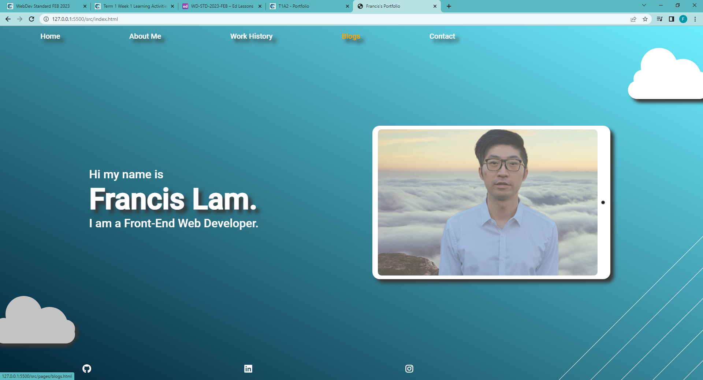
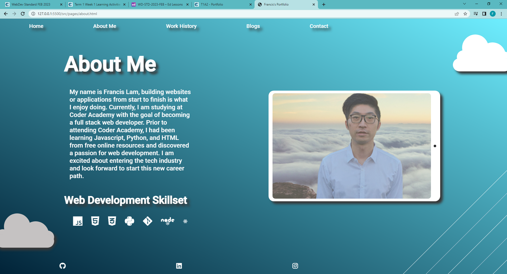
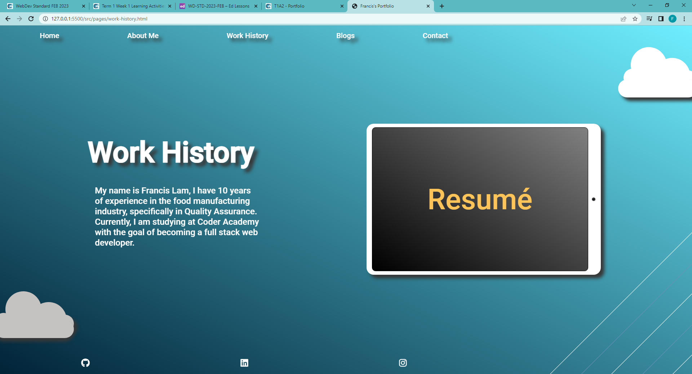
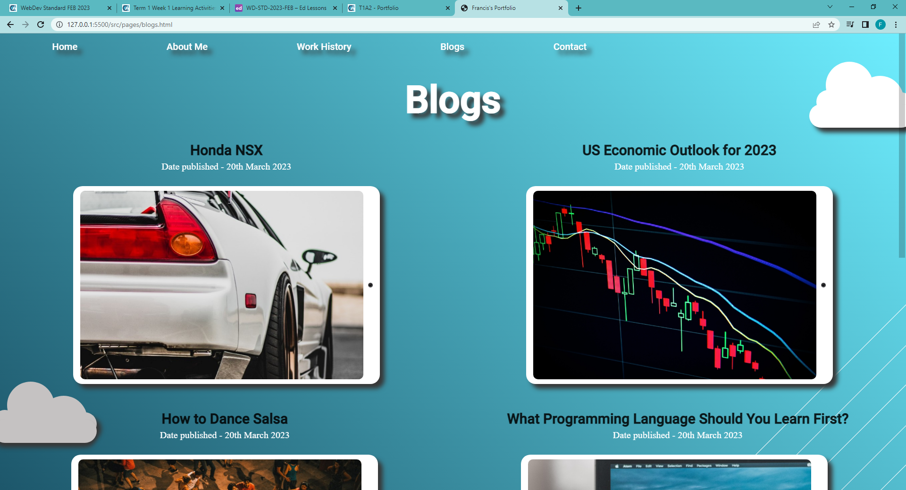
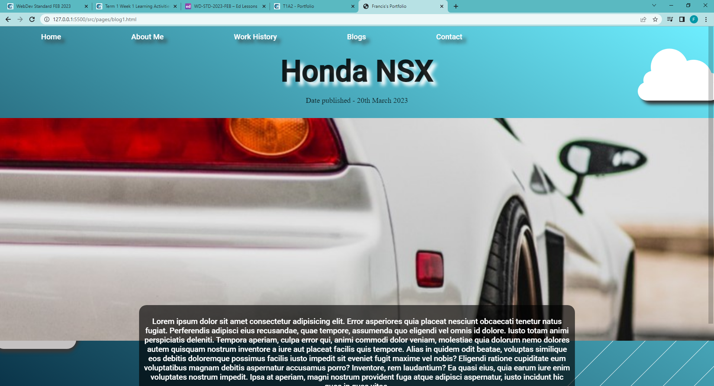
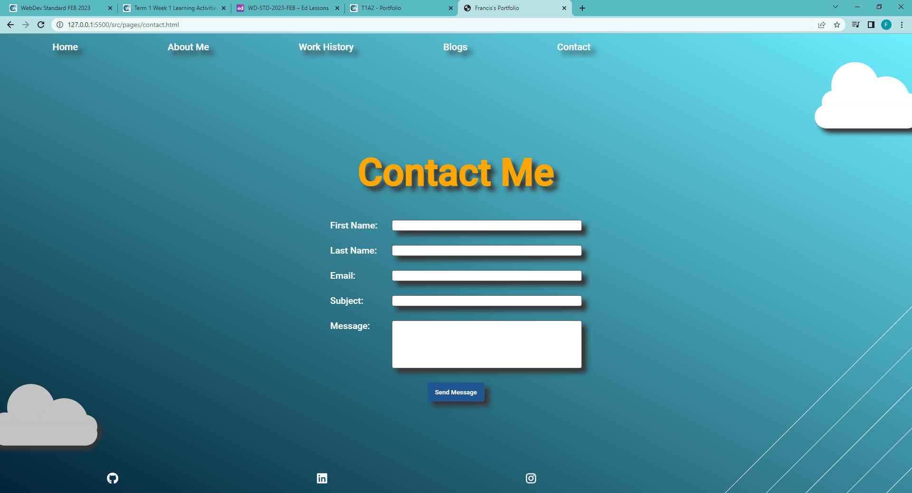
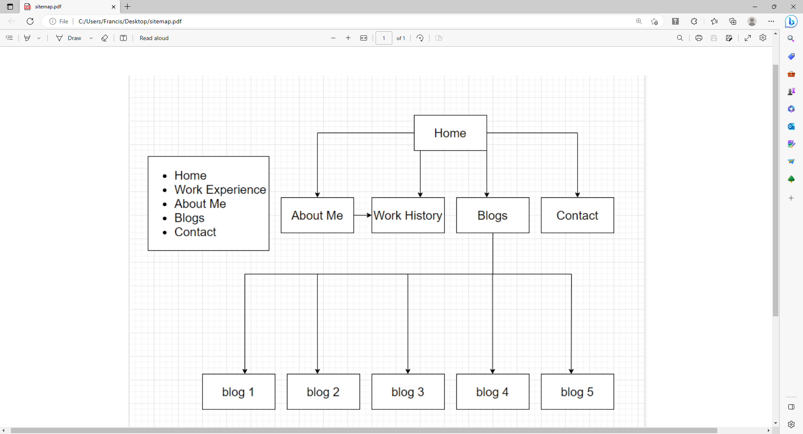

# Francis Lam's Portfolio (T1A2)
## Links
- Link to published portfolio website: [Francis Lam's Portfolio](https://francis-lams-portfolio-t1a2.netlify.app/).
- Link to Github repository: [Github repo](https://github.com/frankie3388/Francis-Lam-portfolio-T1A2).
- Link to presentation video: [Presentation video](https://www.loom.com/share/7e3f6fa13e4d47ee97eff4a06e638b44).

## Purpose

The purpose of this website is to create a portfolio that provides information on who I am, what skills I have, interests, work experience, and to demonstrate my abilities as a web developer to potential employers. I wanted to create a professional looking website that was simplistic, refined, and had a theme of the sky.

## Functionality / Features

### 1. Home page
The home page has a navigation bar at the top of the page that has five elements which navigate to other pages of the website. A text shadow is added to the navbar text to emphasize the importance. When hovered over the text in the navbar, the text becomes yellow, to indicate that it can be clicked on. I chose yellow as it compliments the colour light blue and helps give the page a contrast in color. For the main section of the page I created two sections that I made into a flexbox, so that it would be responsive to changes in browser size. One section contained the picture of myself, which was enclosed in a android or apple tablet. I wanted to create this tablet as I thought it would be different to just making a border around my picture. When you hover over the tablet it highlights to black to indicate that it can be clicked on. This links to my about me page. 

The second section contains text, which you can click on my name and it also takes you to the about me page. I added an animation to the name to flash yellow to indicate that it can be clicked on. At the bottom of the page is the footer, that contains social media links. I used font awesome icons for this and spaced them out evenly. Also, at the bottom right of the page I created a line/graphics design section, to give it a better aesthetic appearance. Two of these lines flash blue continuously. I used position fixed for this design to position it in the bottom right corner of the page. Screenshot of the page is below:-

### 2. About Me page
The about Me page is similar to the home page, except the android tablet component goes to the work history page when clicked on. It has an article section that contains information about me. I also listed some web dev skills and used font awesome icons to represent these skills. I didn't put in the names of the programming languages next to the icons because most employers would know what they are just looking at the icons. I placed a black transparent background behind the text when the browser window shrinks, in order to provide better accessibility (readability) due to the line design at the bottom right of the page overlaps with it. Screenshot of about page is below:-

### 3. Work History Page
The work history page is similar to the about me page, except that the android tablet has a clickable anchor element in it, which navigates to a resume.pdf file. The word "resume" is also flashing yellow to emphasize that it can be clicked on. Screenshot of work history page is below:-

### 4. Blogs page
The blogs page contatins a list of 5 blogs. I used flexbox and flex-wrap property so that the blogs would stack on top of each other when the browser window shrunk. I gave a heading and date published above each blog picture. You can click on the picture or title of the blog and it navigates to the individual blog posts. Screenshot of blogs page below:-

### 5. Individual blog post page
With the individual blog post pages, I centered everything in the main element of the page using flexbox and changed the flex-direction property to column so that the elements in the flexbox would stack on top of each other. I also wanted the image to stretch across the entire page so I made the image element a with of 100% and added the property object fit (cover) so that the aspect ratio would not distort when fitting in the page. I placed a black transparent background on the text for better accessibility/readability. I also wanted the black text box to overlap the image, so I set position to relative and set 100px to the bottom of the page to shift the text box up. I used relative because I wanted the empty space that the text box left behind to add spacing from the footer. Screenshot of the Honda NSX blog post below:-

### 6. Contact Me page
The contact me page has a form element in the center of the page. I used flexbox, flex-direction (column) and align-items (center) to center all the elements inside the flexbox. I then used flexbox on the .form-section class element to evenly center the label and input elements with justify-content (space-between). Space-between evenly spaces the label and input elements without leaving any space on the outside edges of the flexbox. I also used a psuedo-class (focus) on the input elements and placed a white box-shadow on the outside when you click on the input element. On the button I used a psuedo-class of hover and changed the color to a light blue when hovered over. Screenshot of contact form below:-

## Sitemap
The sitemap contains the plan for the overall layout of the website. Basically, the homepage contains a navbar that links to four other pages, which are about me, work history, blogs, and contact pages. The blogs page also navigates to the other blog post articles. Also, the about me page has a link to go to the work history page by clicking on the picture. 

Screenshot of sitemap below:-

## Tech Stack used
- HTML - for building the website.
- CSS - for styling.
- Sass - for styling.
- Git - to upload to github.
- Netlify - to publish the website.
- Github - to share the source code.
- Font awesome - for icons.
- Figma - to develop the wireframes.

